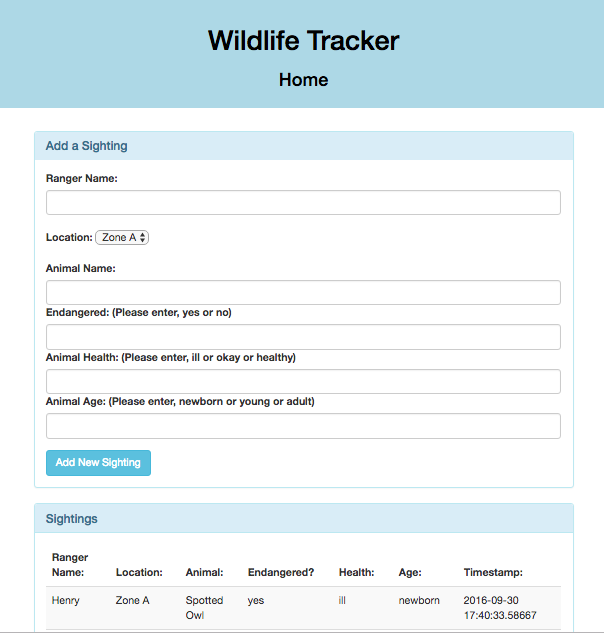

## Project Name
Wildlife Tracker

## Features
This app will help rangers log sightings for animals that may or may not be endangered.

##Technologies
Java, JUnit, Gradle, Spark, PSQL

## Usage
To use the code, you can clone the repository at: [https://github.com/mehequanna/java-project4](https://github.com/mehequanna/java-project4).
* $ git clone https://github.com/mehequanna/java-project4
* $ cd java-project4 (Skip to database instructions below.)
* $ gradle run
* Go to localhost:4567 in your browser

##Database Instructions (postgres/psql)
* Run in terminal: postgres
* Run in new terminal window: psql
* Run in psql: CREATE DATABASE wildlife_tracker;
* Run in terminal inside project directory: psql wildlife_tracker < wildlife_tracker.sql
* Run in psql: \c wildlife_tracker
* Finally check for tables in psql by running: \dt

## Author
Stephen Emery

##License
This work can be used under the MIT License.
Copyright (c) 2016 Stephen Emery
